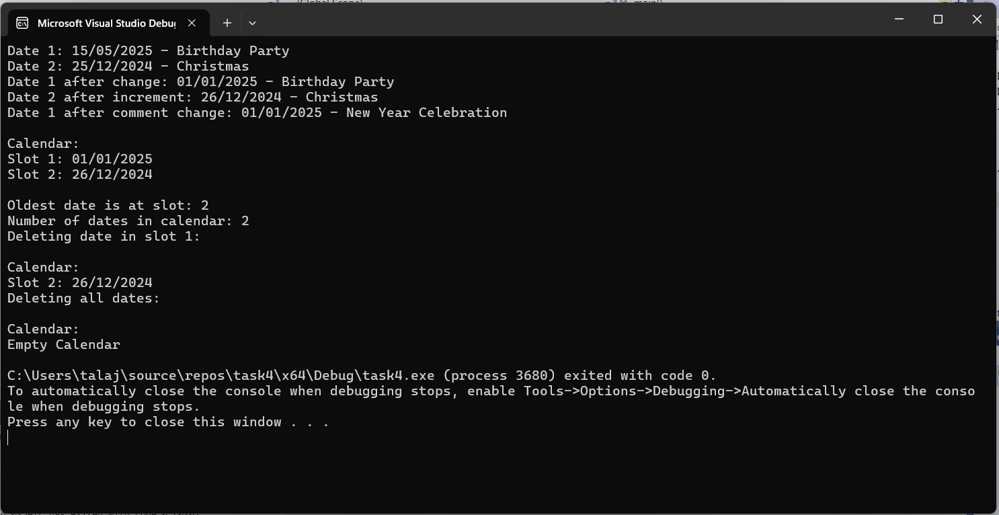

# Calendar & Date Management (C++ OOP Project)

This project implements a simple **Calendar and Date Management System** in C++ using **Object-Oriented Programming** principles.  
It demonstrates the use of **classes, dynamic memory allocation, copy constructors, and encapsulation**.  

---

## Features
- **MyDate class** for handling dates (day, month, year) and attaching comments.
- **Calendar class** that manages up to 30 dates:
  - Insert and remove dates.
  - Find the first free slot.
  - Retrieve the oldest date.
  - Print all stored dates.
- **Dynamic memory management** with proper destructors.
- **Encapsulation** with getters and setters.

---

## Screenshots
Example output of the program:



---

## Project Structure
- `main.cpp` – Runs demo operations on the calendar.  
- `MyDate.h / MyDate.cpp` – Defines and implements the **MyDate** class.  
- `Calendar.h / Calendar.cpp` – Defines and implements the **Calendar** class.  

---

## Example Usage
```cpp
int main() {
    Calendar calendar;
    MyDate date1(2023, 5, 10);
    MyDate date2(2021, 1, 1);

    calendar.insert(date1);
    calendar.insert(date2);

    cout << "Number of dates: " << calendar.datesNum() << endl;
    cout << "Oldest date is in slot: " << calendar.oldest() << endl;

    calendar.print();
    return 0;
}
